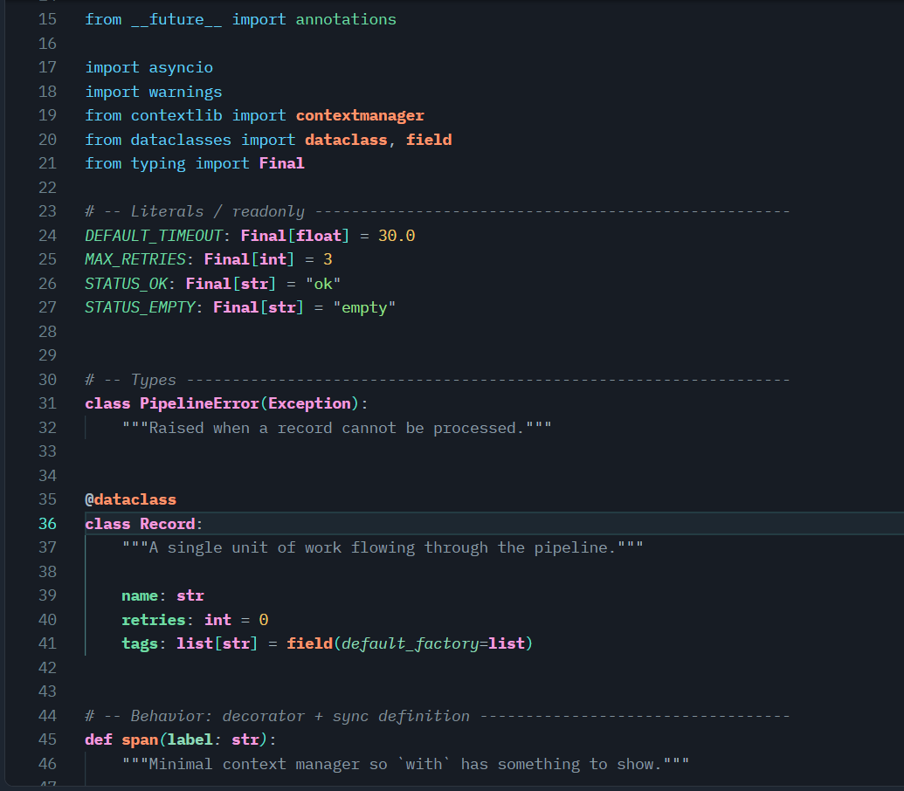
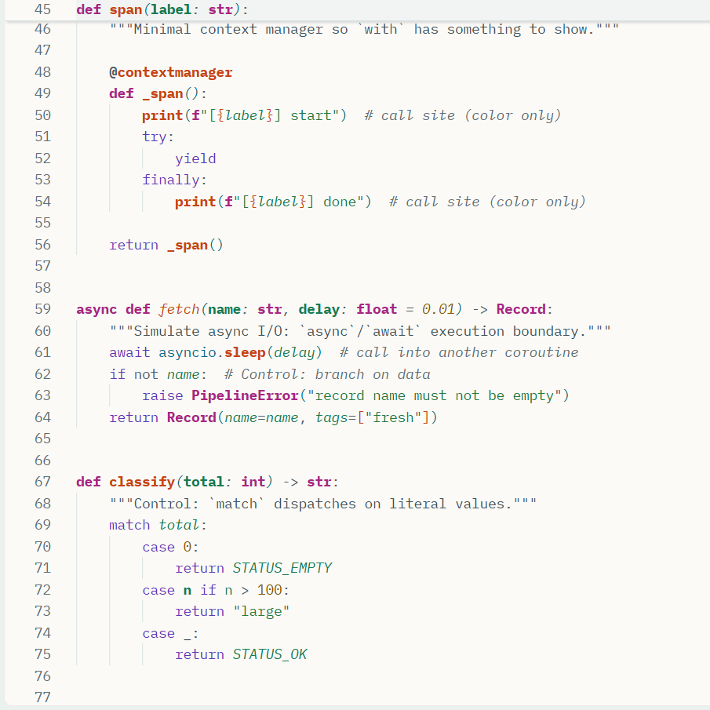

# Code Comprehension Theme

A VS Code theme designed for understanding unfamiliar and AI-generated
code — not just making it look pretty.

🔵 Structure · 🟠 Behavior · 🟣 Types · 🟢 Data · 🟡 Literals · 🟪 Control

## Built for the age of AI-generated code

AI makes producing code cheap.

Understanding it is still expensive.

AI just generated 300 lines of code. How do you know whether it actually
does what you think it does? Code Comprehension Theme is designed to make
that understanding faster — every color answers a question your brain asks
while reading. It won't tell you whether the code is correct; it gives
every part a consistent visual language so you can inspect it more easily.

| Role | Color | Question it answers |
| ---- | ----- | ------------------- |
| 🔵 Structure | Blue | Where does this come from? |
| 🟠 Behavior | Orange | What does this do? |
| 🟣 Types | Magenta | What kind of thing is this? |
| 🟢 Data | Green | What information is moving? |
| 🟡 Literals | Amber / Green | What are the actual values? |
| 🟪 Control | Violet | How does execution flow? |

### Variants

Four variants ship with the theme: **Light**, **Dark**, and colorblind-safe
**Light** and **Dark**. Calm surfaces, vivid roles — important syntax stands
out immediately.

### How the roles read in practice

* **Definitions are bold** while calls use color only, so where something
  is born stands out from where it is used.
* **Modules** arrive underlined and bold.
* **Parameters** sit in italic.
* **Docstrings and block comments** render brighter than inline notes,
  because intent overviews matter most in unfamiliar code.
* **Declarations, readonly values, async boundaries, and deprecated code**
  each carry their own signal.
* **Agent suggestions** appear in muted gray, so proposed code never
  masquerades as committed code.

## Install

From the marketplace (`ext install prasannaba.code-comprehension-theme`),
or from VSIX:

1. Download the latest `.vsix` from
   [Releases](https://github.com/prasannaba/code-comprehension-theme/releases).
2. Open VS Code → Extensions view → `...` → **Install from VSIX...**.
3. Select the downloaded file.

Then select one of the four themes:

* **Code Comprehension Light** / **Dark** — the default palette.
* **Code Comprehension Light Colorblind** / **Dark Colorblind** — same
  six roles remapped to colorblind-safe hues (Okabe-Ito based, distinct
  under protanopia, deuteranopia, and tritanopia). Definitions vs calls
  differ by bold as well as hue, so no role depends on red-green
   discrimination alone. All syntax colors still meet WCAG AA 4.5:1.

## Screenshots

### Dark



### Light



### Colorblind


## Palette reference

Exact hues per variant (all syntax colors meet WCAG AA 4.5:1):

| Role | Light | Dark | Used for |
| ---- | ----- | ---- | -------- |
| Behavior (orange) | `#C74313` defs bold / `#A65408` calls | `#FF956B` / `#FFB36B` | functions, calls — verify these first |
| Types (magenta) | `#A92584` bold | `#F29BDE` bold | classes, types |
| Structure (blue) | `#076A8A` / `#0B5F8A` | `#62CFF4` / `#63E6D8` | imports, namespaces, properties |
| Data (green) | `#177A4E`, params italic | `#6FD9A3`, params `#8FD8B8` italic | variables, parameters |
| Literals (amber/green) | `#8A5700` / `#237A3E` | `#F3C969` / `#9BE28C` | constants, strings |
| Control (violet) | `#5F36B8` | `#B79AFF` | keywords, muted on purpose |

The same six roles carry through outline icons, breadcrumbs, the terminal
palette, and merge-conflict colors, so the whole workbench speaks one
language.

## Recommended settings for comprehension

The theme only sets colors. Pair it with these editor settings for the
full effect (research-backed: distinct glyphs, ~1.5 line height,
bracket guides, verification aids for AI-generated code):

```json
{
  "editor.fontFamily": "JetBrains Mono, IBM Plex Mono, Lucida Console, Consolas, monospace",
  "editor.fontSize": 14,
  "editor.lineHeight": 22,
  "editor.letterSpacing": 0.2,
  "editor.fontLigatures": false,
  "editor.guides.bracketPairs": true,
  "editor.guides.bracketPairsHorizontal": true,
  "editor.bracketPairColorization.enabled": true,
  "editor.stickyScroll.enabled": true,
  "editor.inlayHints.enabled": "on",
  "editor.codeLens": true,
  "editor.renderWhitespace": "trailing",
  "editor.cursorBlinking": "smooth",
  "editor.find.seedSearchStringFromSelection": "always"
}
```

Why: JetBrains Mono (primary) is tuned for code at 13–14px — tall
x-height, distinct `l/I/1 O/0`, aligned brackets; below 12 or above 16
it loses its edge, so keep 14. IBM Plex Mono is the warmer backup,
Lucida Console the zero-install Windows fallback
(no true italic, so the 22px line height plus 0.2 letter spacing keeps
synthesized obliques and dense agent-generated lines readable).
Ligatures stay off so `!=`, `>=` never mislead during verification;
22px line height on 14px type keeps horizontal eye tracking
comfortable; bracket colorization + sticky scroll expose
nesting without background washes; inlay hints and CodeLens surface
types and references so you verify agent code instead of passively
reading it.

## Research

Design decisions above follow published evidence, not taste:

* Syntax highlighting cuts comprehension time and context switches
  (eye-tracking, n=10) — Sarkar 2015:
  <https://ppig.org/files/2015-PPIG-26th-Sarkar1.pdf>
* Richer visual variety (more hues, more constructs incl. weight) cuts
  structure-detection time 21–75% with no objective overload (n=33) —
  Asenov, Hilliges & Müller 2016: <https://doi.org/10.1145/2858036.2858372>
* Intent labels (+23% comprehension) and block over inline comments
  motivate first-class comment rendering:
  <https://arxiv.org/html/2504.19225>,
  <https://link.springer.com/article/10.1007/s10664-025-10727-w>
* AI assistants decouple performance from comprehension; active
  verification loops predict understanding (r=0.96) — hence ghost-text
  styling and verification-first UI:
  <https://arxiv.org/html/2511.02922v2>,
  <https://arxiv.org/html/2501.11264v1>
* Colorblind-safe hues follow Okabe & Ito:
  <https://jfly.uni-koeln.de/color/>
* Font guidance follows JetBrains Mono's design rationale (x-height,
  disambiguation, bracket alignment):
  <https://www.jetbrains.com/lp/mono/>

## Build

```sh
npx @vscode/vsce package --no-dependencies
```
